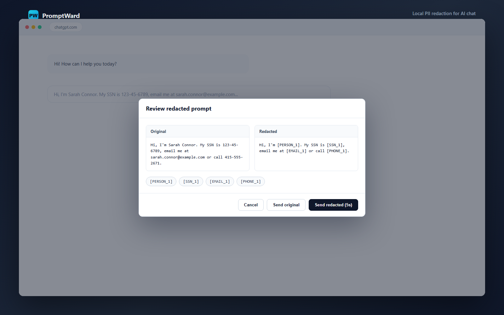

# PromptWard

[](https://github.com/gduplessy/promptward/releases/latest)
[](https://developer.chrome.com/docs/extensions/develop/migrate/what-is-mv3)
[](src/manifest.ts)
[](#how-it-works)
[](./PRIVACY.md)
[](./LICENSE.md)
[](https://github.com/gduplessy/promptward/releases)

PromptWard is a Manifest V3 Chrome extension that catches PII in your prompts before it reaches ChatGPT, Claude, Gemini, Perplexity, or Mistral. Detection and redaction run entirely on-device via a local ONNX model plus deterministic heuristics — no prompt text, no placeholder map, and no telemetry ever leaves your machine.



## Contents

- [Features](#features)
- [Supported sites](#supported-sites)
- [Install (no build required)](#install-no-build-required)
- [How it works](#how-it-works)
- [Known limitations](#known-limitations)
- [Privacy](#privacy)
- [Development](#development)
- [Changelog](#changelog)
- [Acknowledgements](#acknowledgements)
- [License](#license)

## Features

- **Local detection, not a proxy.** An ONNX token-classification model ([Rampart](https://huggingface.co/nationaldesignstudio/rampart)) plus regex/checksum heuristics (SSNs, Luhn-validated card numbers, emails, phone numbers) run inside the extension — no request ever leaves the browser to classify your text.
- **Censor by default, never silent.** A review modal shows original vs. redacted side by side. It auto-sends the redacted version after a 5-second idle timer (covers stepping away from the keyboard), with an explicit **Send original** opt-out and instant cancellation the moment you interact with the modal.
- **Fail-closed on rich-text editors.** Modern chat composers (Lexical, ProseMirror) keep their own internal document state; PromptWard verifies the redacted text actually landed in the editor before allowing a send, and blocks the send rather than silently letting unredacted text through if it can't confirm.
- **Reversible placeholders (foundation).** Redaction keeps a per-conversation map from tokens like `[PERSON_1]` or `[SSN_1]` back to their real values, held only in extension memory. Automatic rehydration of model responses is not wired up yet — replies will show the placeholder tokens as-is.
- **Bring your own domain.** Add any site from the side panel's Custom Domains list, not just the built-in five.

## Supported sites

| Site | Domain |
|---|---|
| ChatGPT | `chatgpt.com`, `chat.openai.com` |
| Claude | `claude.ai` |
| Gemini | `gemini.google.com` |
| Perplexity | `www.perplexity.ai` |
| Mistral | `chat.mistral.ai` |

## Install (no build required)

1. Download the latest `promptward-extension.zip` from [Releases](https://github.com/gduplessy/promptward/releases/latest).
2. Unzip it somewhere permanent (don't delete the folder afterward — Chrome loads the extension from it).
3. Go to `chrome://extensions`, enable **Developer mode** (top right).
4. Click **Load unpacked** and select the unzipped folder.
5. Click the PromptWard icon in your toolbar to open the side panel; it loads the local model automatically the first time.
6. Visit a supported AI chat site and send a prompt containing PII — PromptWard will show a redaction review before it goes out.

## How it works

1. A content script intercepts the send action (click or Enter) on the composer before the page's own handler runs.
2. The prompt text goes to a dedicated Worker, hosted in an MV3 offscreen document so it survives service-worker suspension, which runs the local ONNX model and heuristic detectors.
3. If PII is found, a review modal shows original vs. redacted text; the redacted version auto-sends after 5 seconds of inactivity, or you can send the original / cancel.
4. The extension writes the redacted text back into the composer — trying `execCommand`, a synthetic paste event, and a select-all-then-`beforeinput` sequence in turn, since rich-text editors don't all accept the same input signal — and only replays the send once it can verify the redacted text actually took.

## Known limitations

- Detection is assistive, not a compliance or DLP guarantee: it can miss PII in unusual formatting and will occasionally flag harmless text.
- The redaction verify-and-fail-closed guard means an incompatible composer will block sends entirely (with a visible error) rather than leak PII — safer, but you'll need to report the site if that happens.
- Model responses are not yet rehydrated: replies that reference redacted values show the placeholder tokens (e.g. `[PERSON_1]`) rather than the original text. The placeholder maps that would enable this are kept per conversation/tab and reset on navigation, tab close, or extension reload.

## Privacy

See [PRIVACY.md](./PRIVACY.md) for the full data-handling posture, and [NOTICE.md](./NOTICE.md) for third-party model/runtime attribution (Rampart model, ONNX Runtime Web).

## Development

```sh
npm install
npm run vendor:rampart
npm run vendor:ort
npm test
npm run build
```

Load `dist/` as an unpacked Chrome extension.

### Local model constraint

- Rampart model files are packaged under `public/models/rampart/`.
- ONNX Runtime Web WASM files are packaged under `public/ort/`.
- Runtime remote model loading is disabled in `src/rampart-worker.ts`.
- `models/**` and `ort/**` are intentionally not listed in `web_accessible_resources`.

### Versioning

The release number lives in [VERSION](./VERSION) and is the single source of
truth — `package.json`, the extension manifest (`src/manifest.ts`), and
`APP_VERSION` (`src/shared/debug.ts`) must all equal it, enforced by a test.
Bump all four together with:

```sh
npm run bump-version -- 0.11.0
```

(Don't hand-edit one source — reloading the unpacked extension will silently
show the old number in `chrome://extensions` if the manifest version drifts.)

## Changelog

See [CHANGELOG.md](./CHANGELOG.md) for release history. Current release:
**0.10.1**.

## Acknowledgements

PromptWard's local detection is built on the [Rampart](https://huggingface.co/nationaldesignstudio/rampart) model from National Design Studio — client-side PII redaction for AI assistants, announced [here](https://x.com/tbpn/status/2071706033186373699?s=20).

## License

PromptWard's own code is [MIT licensed](./LICENSE.md). The vendored Rampart model (CC-BY-4.0) and ONNX Runtime Web assets carry their own separate licenses — see [NOTICE.md](./NOTICE.md).
